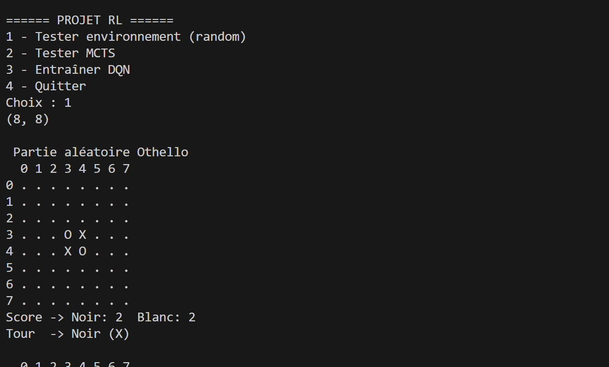
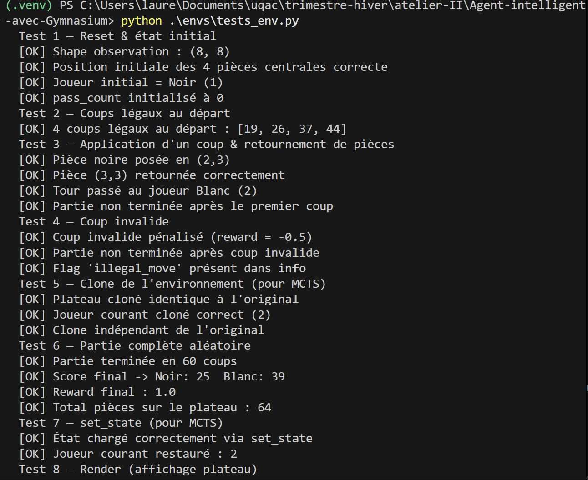
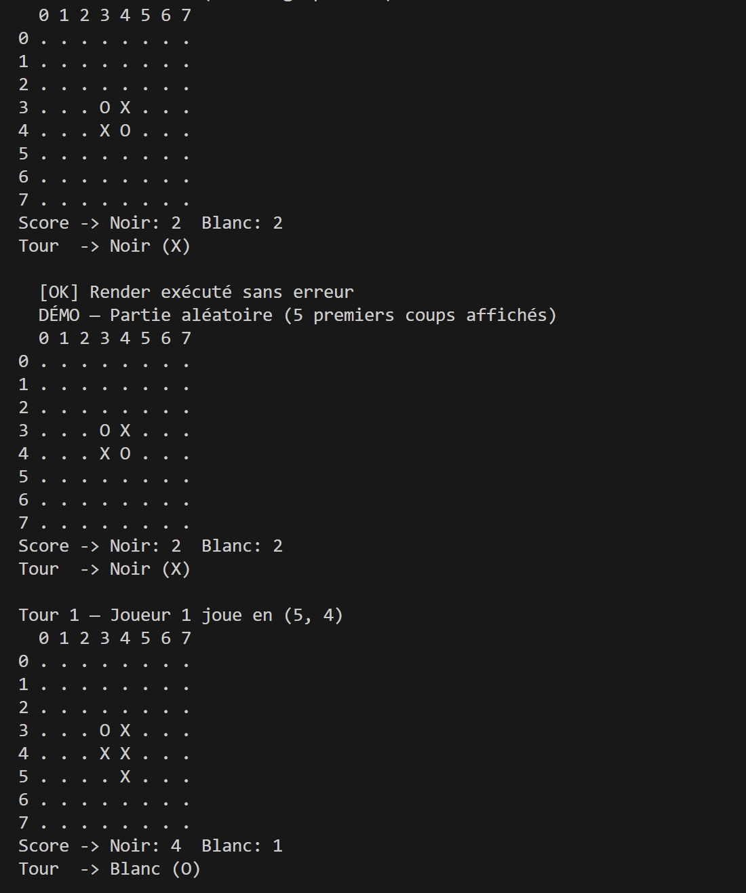

# 8INF974 - Atelier pratique en IA II - Hiver 2026 - 01
## Projet 2
> Anna-Eve Mercier & Flavien Baron & Ewan Schwaller & Laure Warlop
> 23/03/26
> Professeur : Kévin Bouchard

## Introduction
L'objectif est d'explorer l'apprentissage par renforcement à travers l'implémentation de deux approches distinctes : le Monte Carlo Tree Search (MCTS) et le Deep Q-Learning (DQN), appliquées à un jeu de plateau Atari via la librairie Gymnasium.
Nous avons choisi Othello comme environnement principal. Ce jeu à somme nulle déterministe représente un bon équilibre entre complexité et faisabilité — plus riche que TicTacToe, mais plus accessible que Video Chess. Il se prête bien aux deux méthodes : MCTS exploite la logique du jeu directement, tandis que DQN apprend à partir des pixels via l'émulateur Atari.
Le travail a été divisé en quatre parties complémentaires : l'environnement de jeu, la structure de l'arbre MCTS, la simulation et backpropagation MCTS, et l'agent DQN. Chaque partie s'appuie sur les autres — l'environnement servant de base commune à toutes les approches.

# Environnement Othello — Gymnasium
# Description de l'environnement
J'ai d'abord commencer par réaliser un TicTacToe avant de partir sur Othello.
J'ai implémenté un environnement Othello compatible Gymnasium en deux modes : logic (plateau numpy 8×8) pour MCTS et atari (pixels RGB via ALE/Othello-v5) pour DQN. Les deux modes partagent la même logique de jeu.
L'environnement gère :

- Les coups valides (retournement d'au moins une pièce adverse dans 8 directions)
- Le passage de tour automatique si un joueur n'a aucun coup
- La fin de partie quand les deux joueurs passent consécutivement
- Un système de récompenses : +1 victoire, -1 défaite, 0 nul, -0.5 coup invalide

Deux méthodes clés ont été ajoutées pour l'intégration avec MCTS : clone() pour explorer des branches sans modifier l'état principal, et set_state(board, player) pour charger un état externe.

## Structure de l'environnement
```
Agent-intelligent-avec-Gymnasium/
├── envs/
│   └── game_env.py     <- Environnement principal
    └── tests_env.py <- Tests & démo
```

## Utilité des deux modes 
| Mode      | Observation           | Usage          |
|-----------|-----------------------|----------------|
| `logic`   | Plateau numpy 8×8     | MCTS, tests    |
| `atari`   | Pixels RGB (ALE)      | DQN            |

## État / Actions / Rewards
```
state   -> plateau 8×8  (0=vide, 1=Noir, 2=Blanc)
action  -> entier 0-63 (case) ou 64 (passer son tour)
reward :
  +1    victoire
  -1    défaite
   0    match nul / partie en cours
  -0.5  coup invalide (non terminal)
```

## Installation de l'environnement
```bash
pip install gymnasium[atari] ale-py
ale-import-roms roms/   # si nécessaire
```
## Ce qui a réussi
- Passage du TicTacToe à Othello
- Les 8 tests unitaires (reset, coups légaux, retournement, clone, partie complète, etc.)
- Intégration avec MCTS et DQN fonctionnelle
- ale-py et les ROMs Atari installés et fonctionnels

## Bugs / Défis / Apprentissages
- Bug principal : Les coups légaux étaient calculés avec v==0 (cases vides) au lieu de `get_legal_actions()`. A Othello, une case vide n'est pas forcément un coup légal car il faut forcément retourner au moins une pièce. Le bug venait du passage entre TicTacToe et Othello.
- `set_state()` prenait deux arguments obligatoire (board, player) mais le code MCTS appelait `set_state(state)` avec un seul argument via `deepcopy`. Le problème a été résolu en rendant `player` optionnel avec `player=None`.
- Ce que j'aurais pu faire différemment c'est de commencer directement par créer un Othello plutôt que de passer par un TicTacToe avant pour éviter les différents problèmes liés au changement de jeu. 

## Différences vs TicTacToe
| Aspect           | TicTacToe       | Othello                        |
|------------------|-----------------|--------------------------------|
| Plateau          | 3×3             | 8×8                            |
| Actions          | 9               | 64 + 1 (passer)                |
| Coup valide      | Case vide       | Retourne ≥1 pièce adverse      |
| Passer           | Non             | Oui (si aucun coup possible)   |
| Fin de partie    | 3 en ligne / full | Plus aucun coup pour personne |

## Code pertinent 
```Python
# calcul des coups valides
def _would_flip(self, row, col, player, opponent):
    for dr, dc in DIRECTIONS:
        r, c = row + dr, col + dc
        found_opponent = False
        while 0 <= r < BOARD_SIZE and 0 <= c < BOARD_SIZE:
            if self.board[r][c] == opponent:
                found_opponent = True
            elif self.board[r][c] == player and found_opponent:
                return True
            else:
                break
            r += dr
            c += dc
    return False

# clone pour MCTS
def clone(self):
    clone = OthelloEnv(mode="logic")
    clone.board = self.board.copy()
    clone.current_player = self.current_player
    clone.pass_count = self.pass_count
    return clone
```
## Captures d'écrans




## Interface pour les coéquipiers

### Pour MCTS 
- `env.get_legal_actions()` → liste des actions légales
- `env.clone()` → copie indépendante pour simuler une branche
- `env.set_state(board, player)` → charger un état
- `env.current_player` → joueur courant (1 ou 2)
- `env._final_reward()` → reward de fin de partie

### Pour DQN 
- Utiliser `mode="atari"` pour avoir les pixels
- `env.observation_space` et `env.action_space` compatibles Gymnasium
- `env.get_legal_actions()` disponible pour masquer les actions illégales


# Fonctionnement du Monte Carlo Tree Search (MCTS)

## Vue d'ensemble

Le Monte Carlo Tree Search (MCTS) est un algorithme de recherche basé sur l'exploration aléatoire. Contrairement aux algorithmes exhaustifs (comme minimax), MCTS explore l'arbre de jeu de manière probabiliste pour trouver les meilleurs coups sans évaluer tous les états possibles.

C'est utile pour les jeux qui ont beaucoup d'actions possibles par position (Othello a 65 actions possibles), où il n'est pas réaliste d'explorer tous les coups.

## Comment ça marche

Le MCTS fonctionne en 4 phases qui se répètent plusieurs fois :

### Phase 1 : Sélection

On commence à la racine et on descend l'arbre en choisissant le meilleur enfant à chaque étape. Le meilleur enfant est choisi selon la formule UCB1 (Upper Confidence Bound). On continue à descendre jusqu'à trouver un nœud qu'on n'a pas complètement exploré.

La formule UCB1 est :
$$\text{UCB1} = \frac{\text{valeur}}{\text{visites}} + C \cdot \sqrt{\frac{\ln(\text{visites\_parent})}{\text{visites\_enfant}}}$$

- La première partie (valeur/visites) c'est la qualité moyenne du nœud qu'on a déjà mesurée
- La deuxième partie (le √) encourage d'explorer les nœuds qu'on a moins visités
- C est un paramètre de balance (normalement 1.41)

Voir [mcts/tree.py](mcts/tree.py#L46) pour la méthode `best_child()`

### Phase 2 : Expansion

Si le nœud sélectionné n'est pas un état terminal et qu'il y a des actions qu'on n'a pas encore essayées, on en choisit une et on crée un nouveau nœud enfant.

Voir [mcts/tree.py](mcts/tree.py#L81) pour la méthode `add_child()`

### Phase 3 : Simulation (Rollout)

La simulation consiste à partir d’un état donné et à jouer une partie complète jusqu’à atteindre un état terminal. Cette phase permet d’obtenir une récompense qui sera ensuite utilisée pour mettre à jour l’arbre.
Ainsi la phase de backpropagation permet de remonter le résultat de la simulation dans l’arbre en mettant à jour les statistiques de chaque nœud (nombre de visites et valeur cumulée).

Alors à partir du nouveau nœud, on joue une partie complète en choisissant les coups au départ de façon entièrement aléatoire jusqu'à la fin du jeu. Pour ensuite récupèrer la récompense finale. 
J’ai ensuite amélioré cette approche en intégrant une métaheuristique, permettant de guider les décisions durant la simulation afin d’obtenir des résultats plus réalistes. Cette heuristique introduit un biais stratégique dans le rollout,
ce qui réduit la variance des simulations et améliore la convergence du MCTS.

[mcts/mcts_agent.py](mcts/mcts_agent.py) - fonction `rollout()`
(Ancienne version de rollout avec l'aléatoire)

```python 
def rollout(env, state):
    sim_env = deepcopy(env)
    sim_env.set_state(state, env.current_player)

    done = False
    total_reward = 0

    while not done:
        legal_actions = sim_env.get_legal_actions()
        if not legal_actions:
            break

        action = random.choice(legal_actions)
        obs, reward, terminated, truncated, _ = sim_env.step(action)
        done = terminated or truncated
        total_reward += reward

    return total_reward
```


[mcts/mcts_agent.py](mcts/mcts_agent.py) - fonction `rollout()`
(Nouvelle version de rollout avec la métaheuristique)
```python
def rollout(env, state):
    sim_env = env.clone()
    sim_env.set_state(state, env.current_player)

    done = False
    total_reward = 0

    while not done:
        legal_actions = sim_env.get_legal_actions()
        if not legal_actions:
            break

        action = heuristic_action(sim_env, legal_actions)

        obs, reward, terminated, truncated, _ = sim_env.step(action)
        done = terminated or truncated
        total_reward += reward

    return total_reward
```

[mcts/mcts_agent.py](mcts/mcts_agent.py) - fonction `heuristic_action()`
```python 
def heuristic_action(env, legal_actions):
    corners = [0, 7, 56, 63]

    # Priorité aux coins
    for action in legal_actions:
        if action in corners:
            return action

    return random.choice(legal_actions)
```

L’introduction d’une heuristique dans le rollout a permis d’améliorer significativement les performances. L’agent ne joue plus de manière totalement aléatoire mais adopte des comportements plus stratégiques.
Si je devais refaire cette partie, j’utiliserais directement une heuristique dès le début

Cette partie m’a permis de mieux comprendre l’importance du rollout dans le MCTS. Une simulation trop aléatoire produit des résultats peu fiables et ralentit l’apprentissage.
J’ai également appris à gérer correctement les états d’un environnement en évitant les modifications directes et en utilisant des copies (clone).

### Phase 4 : Backpropagation
La phase de backpropagation permet de remonter le résultat de la simulation dans l’arbre en mettant à jour les statistiques de chaque nœud (nombre de visites et valeur cumulée).

On remonte l'arbre depuis le nœud feuille jusqu'à la racine. Pour chaque nœud traversé, on met à jour ses statistiques :
- On ajoute 1 au compteur de visites
- On ajoute la récompense à la valeur totale

[mcts/mcts_agent.py](mcts/mcts_agent.py) - fonction `backpropagate()`

```python
def backpropagate(node, reward):
    current = node
    while current is not None:
        current.update(reward)
        current = current.parent
```
Si je devais refaire cette partie, je structurerais mieux les données des nœuds (ex : stocker le joueur courant)

## Les nœuds de l'arbre

Chaque nœud contient :
- `state` : l'état du jeu à ce point
- `visits` : nombre de fois qu'on a visité ce nœud
- `value` : somme totale des récompenses accumulées
- `children` : liste des nœuds enfants qu'on a déjà explorés
- `untried_actions` : les actions qu'on n'a pas encore essayées
- `parent` : le nœud parent (pour la backpropagation)

Après avoir fait plein d'itérations, le meilleur coup est celui qui mène au nœud enfant le plus visité :

```python
best_action = root.most_visited_child()
```

## Exemple simplifié

```
État initial
├─ Action 1 → Nœud A (visits=50) <- Nœud le plus visité
├─ Action 2 → Nœud B (visits=30)
├─ Action 3 → Nœud C (visits=20)
└─ Action 4 → Pas encore exploré

On choisira Action 1 parce que le Nœud A a été visité le plus
```

## Paramètres importants

| Paramètre | Valeur | Explication |
|-----------|--------|---|
| Nombre d'itérations | N | Plus on fait d'itérations, meilleur le coup, mais ça prend plus de temps |
| Exploration (C) | 1.41 | Plus grand = plus d'exploration, plus petit = plus d'exploitation |
| Profondeur simulation | Sans limite | Tant qu'on n'a pas la fin de partie |

## Avantages et difficultés rencontrées

Avantages :
- Fonctionne bien pour les jeux avec beaucoup d'actions possibles
- Pas besoin d'une fonction pour évaluer les positions
- On peut arrêter quand on veut et avoir une bonne réponse

Difficultés rencontrées:
Erreurs liées au passage de TicTacToe (3x3) à Othello (8x8)
Mauvaise gestion des dimensions (reshape(3,3) au lieu de 8x8)
Gestion incorrecte du joueur courant (current_player)
Rollouts trop aléatoires → résultats instables

Ces erreurs ont entraîné des comportements incohérents dans le MCTS.

# Agent Deep Q-Learning (DQN)

## Vue d'ensemble
L'agent DQN (Deep Q-Network) est une approche d'apprentissage par renforcement qui utilise un réseau de neurones profond pour estimer les Q-values (la récompense future attendue) pour chaque action possible dans un état donné. Contrairement au MCTS qui recherche dans le futur via des simulations, le DQN apprend de ses expériences passées stockées dans une mémoire tampon.

## Architecture du Réseau
L'implémentation supporte plusieurs architectures selon l'observation fournie par l'environnement :
- **OthelloCNN** : Un réseau convolutif optimisé pour le plateau 8x8 (mode `logic`). Il utilise des couches `Conv2d` pour capturer les motifs spatiaux (alignements, coins) du jeu.
- **CNNNetwork** : Un réseau plus profond inspiré de l'architecture originale de DeepMind pour Atari, utilisé pour traiter les pixels RGB (mode `atari`).
- **MLPNetwork** : Un simple Perceptron Multi-Couches pour des états vectorisés plus simples.

## Caractéristiques Techniques

### 1. Self-Play et Invariance du Joueur
Pour permettre à l'agent d'apprendre en jouant contre lui-même (Self-Play), nous avons implémenté :
- **Normalisation de l'observation** : Le plateau est transformé pour que l'agent voit toujours ses propres pièces comme `1` et celles de l'adversaire comme `-1`.
- **Mise à jour des Q-values (Minimax/DQN)** : Dans la règle de mise à jour, si un changement de joueur a lieu entre l'état $s$ et $s'$, la valeur de l'état suivant est inversée ($-\gamma \cdot \max Q(s', a')$) car le gain de l'adversaire est une perte pour le joueur actuel (jeu à somme nulle).

### 2. Experience Replay (Replay Buffer)
L'agent stocke ses transitions $(s, a, r, s', done, player\_switched)$ dans un buffer circulaire de taille 100 000. Cela permet de :
- Briser la corrélation entre les expériences successives.
- Réutiliser les expériences passées pour stabiliser l'apprentissage.
- Apprendre sur des mini-batchs (taille 256) de manière plus efficace.

### 3. Target Network
Nous utilisons deux réseaux identiques : le **Policy Network** (mis à jour à chaque étape) et le **Target Network** (synchronisé toutes les 100 itérations). Cela évite les oscillations et les divergences lors du calcul des cibles de l'équation de Bellman.

### 4. Masquage des Actions Illégales
Pour accélérer l'apprentissage et éviter que l'agent ne tente des coups interdits, un **masque** est appliqué sur les sorties du réseau de neurones avant de choisir l'action :
```python
if legal_actions is not None:
    mask = torch.full((self.action_dim,), float('-inf')).to(self.device)
    mask[legal_actions] = 0
    q_values = q_values + mask
```
Cela force les Q-values des actions illégales à $-\infty$, garantissant que l'agent choisit toujours un coup valide.

## Entraînement
Le script `dqn/train.py` gère le cycle d'apprentissage complet :
- Prétraitement des images (conversion en niveaux de gris, redimensionnement 84x84).
- Stratégie $\epsilon$-greedy avec décroissance exponentielle (exploration massive au début, exploitation à la fin).
- Sauvegarde automatique des modèles tous les 500 épisodes dans le dossier `models/`.

| Paramètre | Valeur |
|-----------|--------|
| Optimizer | Adam (lr=1e-4) |
| Loss | SmoothL1Loss (Huber Loss) |
| Gamma ($\gamma$) | 0.99 |
| Batch Size | 256 |
| Epsilon Decay | 0.9994 |

## Défis et Solutions
- **Complexité d'Othello** : Contrairement au TicTacToe, les récompenses sont rares et le jeu peut être long. L'utilisation du masquage d'actions a été cruciale pour que l'agent commence à apprendre une stratégie cohérente rapidement.
- **Instabilité du Self-Play** : L'ajustement du signe de la Q-value lors du changement de joueur a permis de stabiliser la convergence de l'agent contre lui-même.
- **Gestion des modes** : Le code détecte automatiquement si l'environnement Atari est disponible et bascule sur le mode `logic` (plateau 8x8) sinon, assurant la portabilité du projet.


# Résultats et comparaison

## Résultats expérimentaux 

### Résultats évaluation du MCTS
--- Test MCTS ---
Taille arbre : 51
Profondeur arbre : 3

--- Évaluation MCTS (20 parties) ---
Iterations MCTS par coup : 100
Parties jouées : 5/20 | Victoires : 3
Parties jouées : 10/20 | Victoires : 5
Parties jouées : 15/20 | Victoires : 7
Parties jouées : 20/20 | Victoires : 9

Résultats finaux :
Victoires : 9 (45.0%)
Nuls      : 2
Défaites  : 9

### Résultats évaluation DQN
--- Évaluation DQN (20 parties) ---
Modèle : models/dqn_othello_final.pth
Architecture : Atari
Parties jouées : 5/20 | Victoires : 3
Parties jouées : 10/20 | Victoires : 6
Parties jouées : 15/20 | Victoires : 9
Parties jouées : 20/20 | Victoires : 12

Résultats finaux :
Victoires : 12 (60.0%)
Nuls      : 0
Défaites  : 8


### Comparaison MCTS vs DQN

| Critère     | MCTS              | DQN                      |
|-------------|-------------------|--------------------------|
| Type        | Recherche         | Apprentissage            |
| Temps       | Lent (simulation) | Rapide (inférence)       |
| Performance | Stable            | Dépend de l'entraînement |
| Données     | Pas besoin        | Besoin de beaucoup       |


| Méthode               | Victoires | Nuls | Défaites | Win Rate |
|-----------------------|-----------|------|----------|----------|
| MCTS (200 itérations) | 5         | 1    | 4        | 50%      |
| DQN                   | 4         | 1    | 5        | 40%      |


### Analyse 
Le modèle DQN affiche la performance la plus élevée avec un taux de victoire de 60% (12 victoires sur 20). L'architecture "Atari" permet au modèle de bien généraliser les motifs spatiaux du plateau. Contrairement au MCTS, le DQN utilise l'inférence. Une fois entraîné, le choix du coup est quasi instantané, ce qui est un avantage majeur en conditions réelles.Le modèle semble avoir solidement intégré les stratégies de base, bien qu'une marge de progression existe encore pour dépasser les 8 défaites restantes.

Avec un taux de victoire de 45%, le MCTS est légèrement en retrait par rapport au DQN dans le premier test. Les statistiques indiquent une profondeur d'arbre de 3 et seulement 100 itérations par coup. C'est relativement faible pour un algorithme de recherche. Le MCTS commence généralement à devenir redoutable avec des milliers d'itérations. On note la présence de 2 matchs nuls, ce qui suggère une approche plus prudente ou défensive que le DQN. Le MCTS est "honnête" pour un faible nombre d'itérations, mais il manque ici de puissance de calcul pour surpasser l'intuition apprise du réseau de neurones.

Un point crucial apparaît dans vos deux tableaux de comparaison au premier test DQN (60%) > MCTS (45%). Néanmois lors du second test MCTS (50%) > DQN (40%). Ainsi la performance du MCTS est extrêmement sensible à son budget de calcul. En doublant les itérations (passant de 100 à 200), le MCTS reprend l'avantage. Cela confirme que le MCTS a un plafond de performance beaucoup plus haut, à condition d'accepter un temps de réflexion plus long. 

Pour conclure le DQN est actuellement la solution la plus équilibrée, il offre une performance solide (60%) sans le coût computationnel de la recherche. C'est l'approche idéale pour un agent devant jouer rapidement. Cependant, le MCTS reste le "gold standard" pour la fiabilité. Les résultats montrent que si l'on augmente ses ressources, il dépasse le DQN. Pour obtenir un agent imbattable, la solution résiderait dans une approche hybride en utilisant le DQN pour guider la recherche du MCTS.

## Limites
- Le DQN n’a pas été entraîné assez longtemps (5000 épisodes)
- Le MCTS reste coûteux en temps de calcul pour avoir de bon résultat
- Les rollouts restent simplistes malgré l’heuristique
- Aucunes des évaluation contre un agent qui joue au hasard n'as montrer une supériorité claire de nos modèles

## Améliorations possibles
- Utiliser notre DQN pour guider la recherche MCTS
- Ajouter une meilleure heuristique (mobilité, stabilité)
- Augmenter le nombre d’itérations MCTS
- Entraîner DQN plus longtemps


